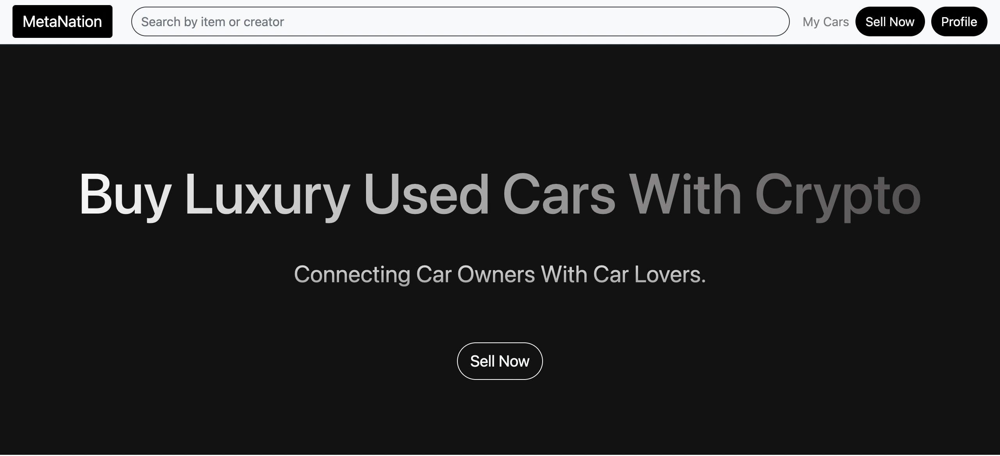

# `MetaNation`

## Description
Used car prices have soared by hundreds of pounds this year as more people are buying second-hand vehicles. One popular model has increased 57% in price since 2019 as a shortage of new cars means more drivers are interested in older cars. 

Metanation aims to target used luxury car market which is also growing at a similar rate and owners of such cars are already investing into crypto. It will act a marketplace that will charge some percentage once it establishes a certain audience. At the moment the only cost the seller or buyer has to pay is the gas fee which is minuscule on Polygon chain. The proceedings from the marketplace will be utilised to create greener sources of transport options later on.

## What I have learned and implemented:
1. A NFT minting Dapp that allows car owners to list their car. It is accomplished using a smart contract on the Polygon blockchain. All the NFTs are minted as ERC721 standard. I wanted to explore ERC 1155 standard too to utilise its even lesser gas fee feature and some more but time was a constraint.
2. A Marketplace app is created where all the car NFTs will be listed on the homepage. People can buy, sell and even rent their car through the marketplace. The Marketplace contract and logic is completely on Polygon chain.
3. The renting mechanism is developed with the help of SuperFluid money stream feature. I could not integrate it with the main app as I imagined. 
4. Moralis SDK is utilised to interact with the contract and save NFT data on IPFS. Moralis is a very powerful tool and was very helpful too but I faced many problems integrating it with React as I was a total novice from that perspective but this was a very good learning process overall. 
5. After making multiple attempts with React (state management and all) I decided to implement in Vanilla JavaScript, HTML and Bootstrap and it came out better than expected. But I plan to make it a market ready app for which I will develop on it.

## Summary
Languages used: JavaScript, HTML, CSS, Bootstrap, Solidity
Tools: Moralis SDK, Superfluid SDK, Truffle for testing contracts

